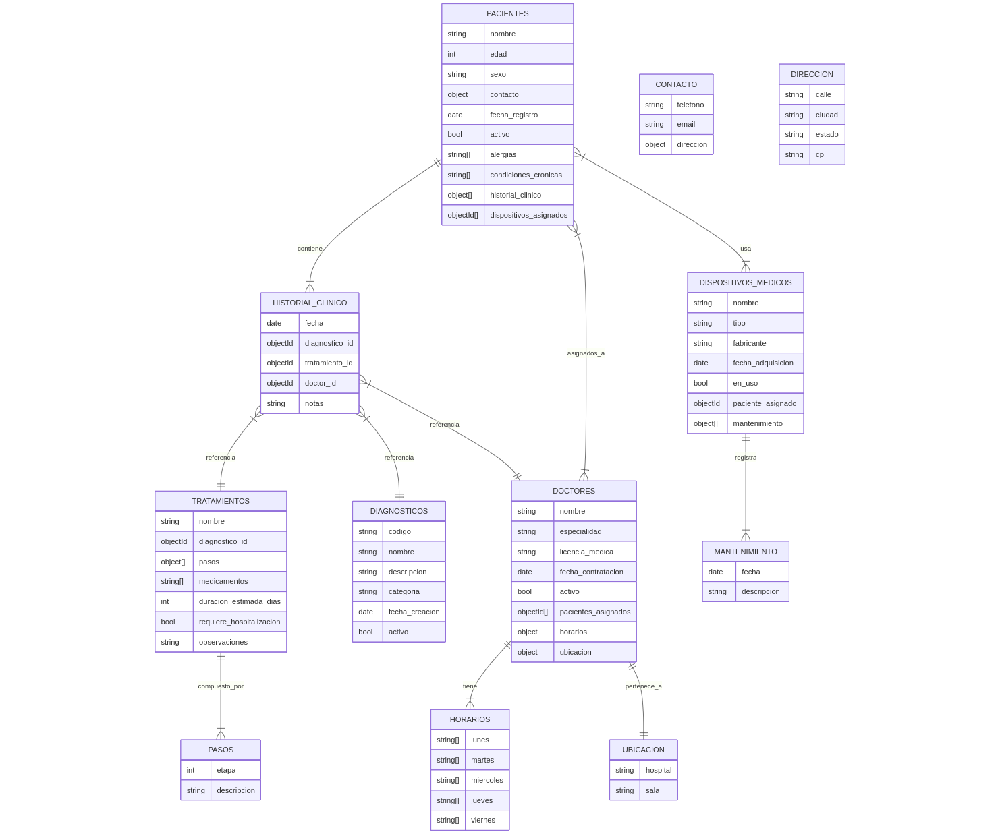
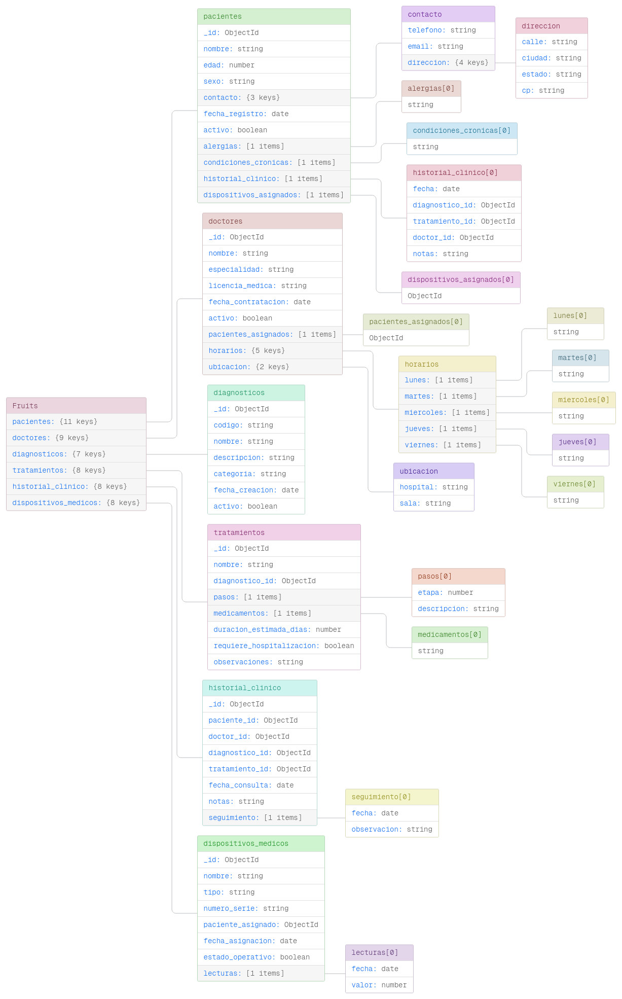

# big-data repository

Este proyecto es una solución de análisis y procesamiento de datos a gran escala, diseñada para manejar conjuntos de datos voluminosos y complejos. El objetivo principal es facilitar la ingestión, transformación y exportación de datos, permitiendo su análisis eficiente y visualización. El repositorio incluye scripts para la manipulación de datos, así como herramientas para exportar resultados en diferentes formatos.

A continuación se presentan dos diagramas clave para comprender la estructura y el flujo de datos del proyecto:

### Esquema jerárquico de datos



### Diagrama Esquematico basado en las colecciones



## Ejecución del proyecto

Sigue estos pasos para ejecutar el proyecto:

1. Clona el repositorio:

   ```bash
   git clone https://github.com/tu-usuario/bigdata.git
   cd bigdata
   ```

2. Instala las dependencias necesarias:

   ```bash
   pip install -r requirements.txt
   ```

3. Ejecuta el proyecto:
   ```bash
   python main.py
   ```

Asegúrate de tener Python `3.13` instalado y configurado en tu sistema. Consulta la sección de configuración si necesitas personalizar parámetros o variables de entorno.

## Exportar datos desde el script en la carpeta `utils`

Para exportar los datos generados por el script ubicado en la carpeta `utils`, sigue estos pasos:

1. Navega a la carpeta `utils`:

   ```bash
   cd utils
   ```

2. Ejecuta el script de exportación (por ejemplo, `export_data.py`):

   ```bash
   python export_data.py
   ```

3. Los datos exportados se guardarán en el directorio especificado dentro del script. Revisa el archivo o la documentación del script para más detalles sobre el formato y la ubicación de los datos exportados.
